# Bindu Nagaraj
# IA626_EARLY NEWS BREAK DETECTION AND IMPACT ANALYSIS

## Overview of Project  

The goal of this project is to determine whether public search behaviour (Google Trends) can act as an early indicator of breaking news events, and to analyse how news sentiment changes before and after official confirmation of an event.
The project specifically investigates:
•	Whether public interest begins before official news breaks
•	How sentiment evolves around the breaking point
•	Whether sentiment changes can predict search spikes

## General Approach (Pipeline Overview) 

This project integrates news content, public search behaviour, and time-series analysis to detect and analyze breaking news events

## API Key Setup

This project requires an API key to run.
For security reasons, the API key is NOT included in this repository.

### Steps:
1. Create a file named ‘.env’ in the project root directory
2. Add the following line to the ‘.env’ file: 
API_KEY= api_key_here
3. Save the file
4. Run the project
The ‘.env’ file is intentionally excluded using ‘.gitignore’.

## Data Sources
•	NewsAPI – news articles and headlines
•	Google Trends (PyTrends) – public search interest
•	VADER NLP – sentiment analysis

# Logical Data Flow

NewsAPI Articles
        │
        ▼
Sentiment Analysis (VADER)
        │
        ▼
Daily News Sentiment
        │
        ├───► Lagged Sentiment → Search Correlation
        │
        ▼
Google Trends (Search Volume)
        │
        ▼
Official Break Detection (t₀)
        │
        ▼
Pre-break (t₋₃..t₋₁) vs Post-break (t₀..t₊₃)
        │
        ▼
Metrics, Reports, Visualizations

## The full pipeline is implemented in the gile :IA626_EARLY NEWS BREAK DETECTION AND IMPACT ANALYSIS.py

## Dependent packages

import os,time,json,requests, time
import pandas as pd
import matplotlib.pyplot as plt
from datetime import datetime, timedelta
from vaderSentiment.vaderSentiment import SentimentIntensityAnalyzer
from pytrends.request import TrendReq

## 1.Configuration & Setup:

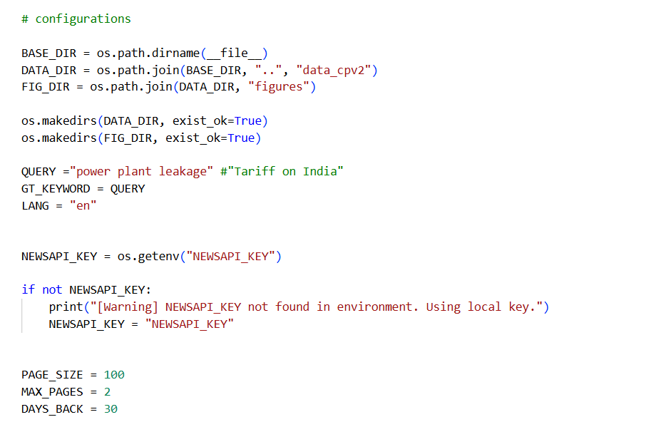

The project sets up organized directories for storing data and figures to ensure clean and reproducible output management. It defines essential parameters, including the search keyword, API key with an environment-variable fallback, a 30-day news lookup window, and pagination limits for fetching articles from NewsAPI.

## 2.	Fetch news articles using News API
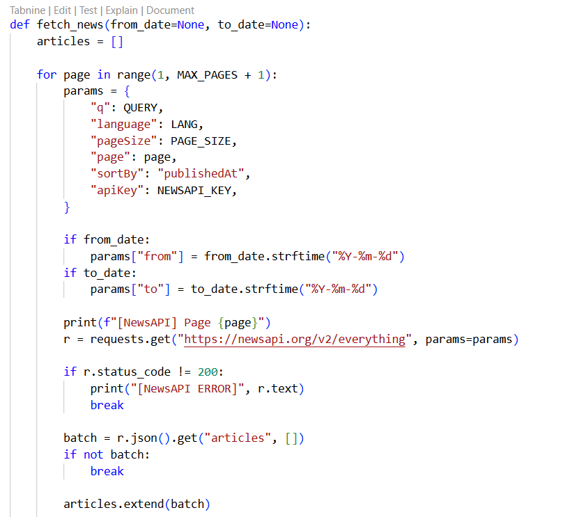
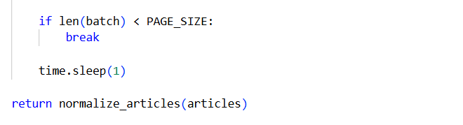

The fetch_news() function retrieves news articles from NewsAPI by iterating through the configured number of pages. For each page, it builds a request with parameters such as the query keyword, language, date range, and API key. It sends the request, checks for errors, and collects all returned articles until either pages are exhausted or fewer results than expected are received. A short delay is added between calls to respect API limits, and finally, all fetched articles are passed to a normalization function for cleaning.

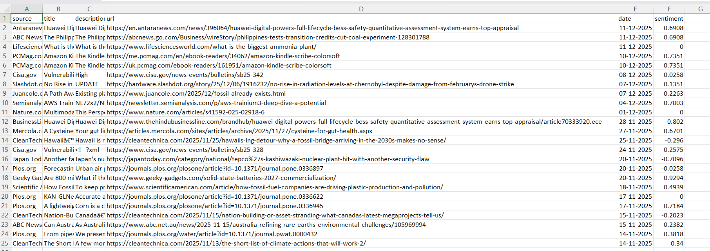

This table lists all news articles collected for the analysis, including their source, title, description, URL, publication date, and computed sentiment score.
These articles form the basis for calculating daily sentiment and understanding how media tone changed before and after the break.
The dataset shows a mix of positive, negative, and neutral articles, which helps measure overall sentiment trends.

## 3. Compute sentiment using VADER

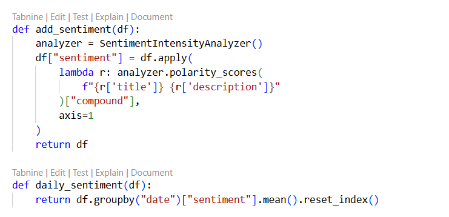

The add_sentiment() function computes sentiment scores for each news article by combining its title and description and processing the text using VADER’s sentiment analyzer. The resulting compound sentiment score is added as a new column in the dataset. The daily_sentiment() function then aggregates these scores by date, calculating the average sentiment per day to identify overall emotional trends in the news coverage.

## 4.Fetch Google Trends daily search volume

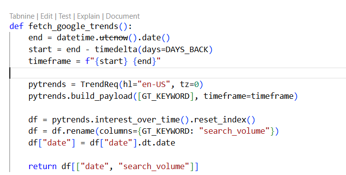

The fetch_google_trends() function collects search-interest data for the target keyword using the Google Trends API (pytrends). It defines a time window based on the last DAYS_BACK days, builds the query payload, and retrieves daily search-volume values. The results are cleaned by renaming columns and converting the timestamp to a date format, returning a simplified dataset containing only the date and corresponding search volume

## 5.Official Break Detection (t0)

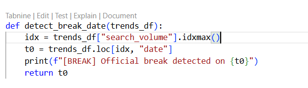

The detect_break_date() function looks through all the Google search data and finds the day when people searched for the topic the most. That highest-search day is treated as the “break point,” meaning something important or unusual likely happened on that date. The function prints this date and sends it back so the rest of the analysis can use it.

## 6.Pre-Break vs Post-Break Analysis

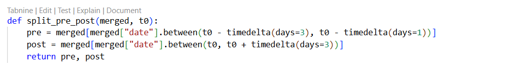

The split_pre_post() function divides the data into two parts:
Pre-break: the 3 days before the detected break date.
Post-break: the break date itself plus the next 3 days.
This helps compare what happened right before the event and what changed immediately after it.

post_break_window
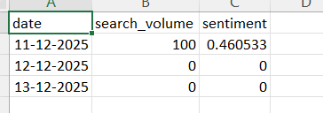

The post-break window shows that search activity peaks on the break day (100 searches on 11-12-2025) and then drops to zero on the following days. Sentiment is positive on the break day (0.46) but becomes neutral afterward, indicating the impact was concentrated mainly on the day of the event

pre_breaking_window

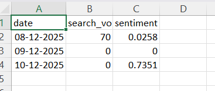
Before the break, search activity appears on 08-12-2025 with a value of 70, showing early public interest.
Sentiment stays low on 08-12 but becomes highly positive on 10-12-2025 (0.73), indicating strong emotional news coverage just before the event.
This supports the presence of an early signal leading up to the break.

## 7.Generating Day-Wise Break Report

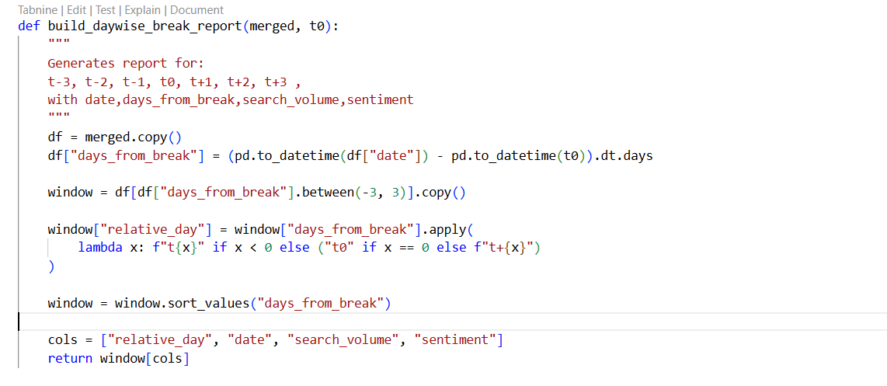

The build_daywise_break_report() function creates a small 7-day report showing what happened around the break date. It calculates how many days each record is before or after the break (t-3, t-2, t-1, t0, t+1, t+2, t+3). Then it keeps only these days and labels them clearly. The final output shows each day’s label, actual date, Google search volume, and sentiment score so you can easily compare changes before and after the event.

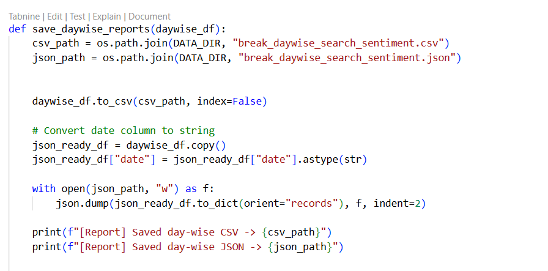

The save_daywise_reports() function saves the 7-day break analysis in two formats: a CSV file and a JSON file. It first writes the table directly to a CSV, then converts the dates into plain text so they can be saved safely in a JSON file. After saving both files, it prints messages showing where the reports were stored. This ensures the results can be easily shared, reused, or visualized later.

break_daywise_search_sentiment.json

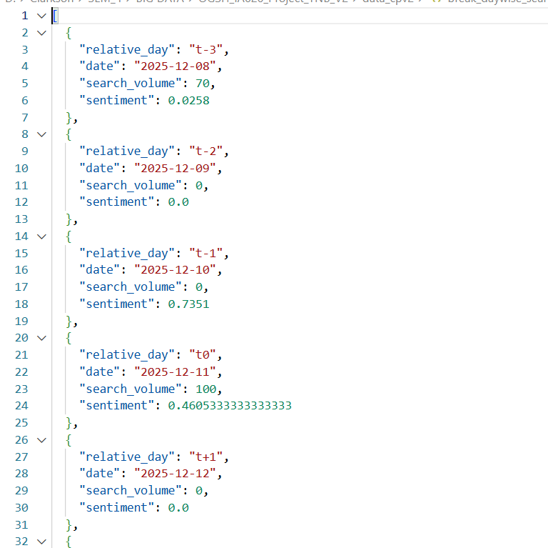

break_daywise_search_sentiment.csv

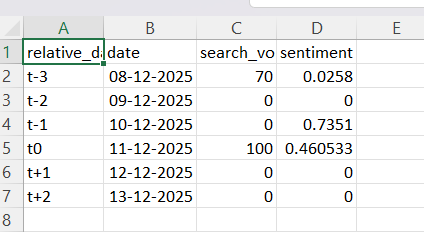

The table shows search volume and sentiment for the 3 days before and 3 days after the break. Search interest spikes sharply on t0 (100) and moderately on t-3 (70), while most other days show no activity. Sentiment also peaks on t-1 (0.73) and stays positive on the break day (0.46), indicating strong emotional news coverage around the event.

## 8.Metrics Computation

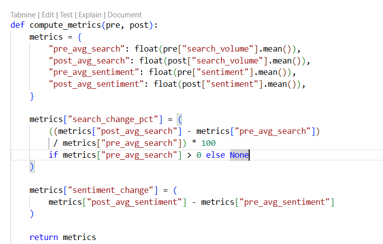

The compute_metrics() function compares what happened before the break and after the break. It calculates the average search volume and average sentiment for the pre-break days and the post-break days. Then it measures how much search activity increased or decreased (in percentage) and how much the overall sentiment changed. These metrics help quantify the impact of the event in a clear and measurable way.

## 9. Lagged Sentiment–Search Correlation

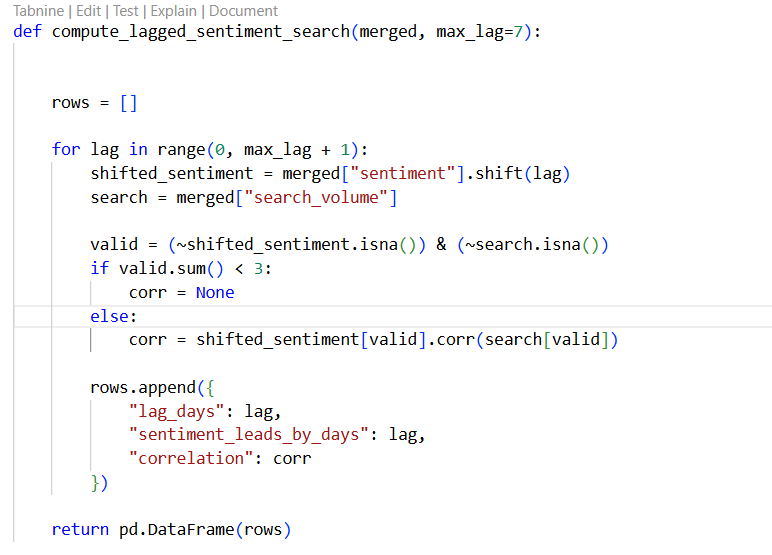

The compute_lagged_sentiment_search() function checks whether sentiment changes happen before changes in search activity. It shifts the sentiment data by 0 to 7 days and calculates how strongly each shifted version matches the search-volume trend. If enough valid data points exist, it computes the correlation; otherwise, it returns None. The final table shows, for each lag (0–7 days), how many days sentiment “leads” search and how closely the two move together.

lagged_sentiment_search.csv

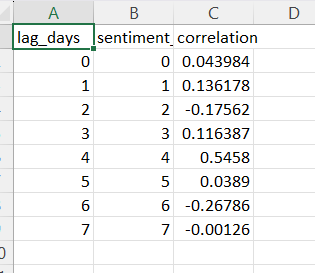

This table shows how well sentiment predicts search activity after a certain number of days. The strongest correlation occurs at lag = 4 days (0.5458), meaning sentiment changes appear about 4 days before search spikes. Negative correlations ( lag 6 = –0.26786) indicate days where sentiment and search move in opposite directions.

## 10. spre-break news fetch and creating pre and post break reports

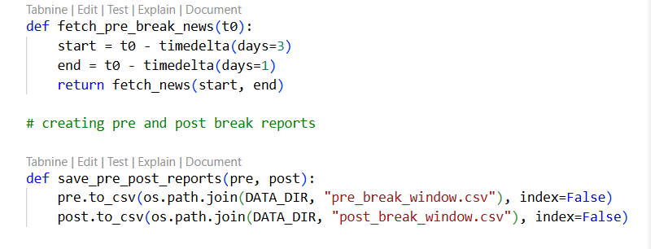

The fetch_pre_break_news() function collects news articles from the 3 days just before the break date. This helps understand what information or events might have caused the spike in attention.

The save_pre_post_reports() function then saves both the pre-break and post-break datasets into separate CSV files. This makes it easy to analyze, compare, or visualize what changed before and after the break event.

## 11. Visualizations

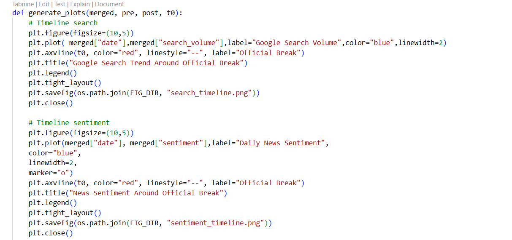

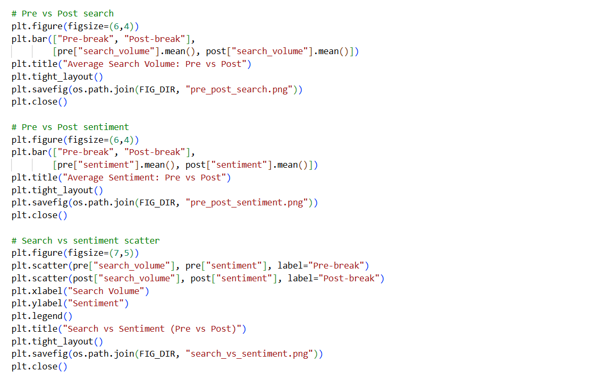 

The generate_plots() function creates different visual charts to help understand how search behavior and sentiment changed around the break date.

#### - Search Timeline Plot:
Shows how Google search activity changed over time and marks the break date so we can see the spike clearly.

#### - Sentiment Timeline Plot:
Shows how the news mood (positive/negative) changed each day and whether it shifted around the break date.

#### - Pre vs Post Search Bar Chart:
Compares average search volume before and after the break to show if public interest increased or decreased.

#### -Pre vs Post Sentiment Bar Chart:
Compares average news sentiment before and after the break to show if the tone became more positive or negative.

#### -Search vs Sentiment Scatter Plot:
Shows how search volume and sentiment relate to each other, with pre-break and post-break points shown separately.

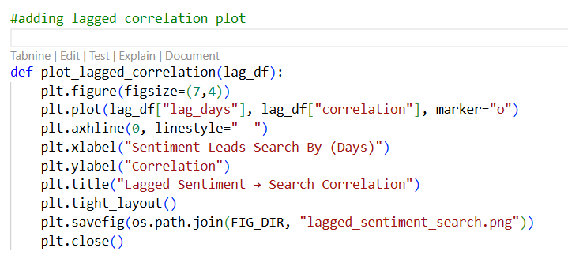

#### Lagged Correlation Plot 

This plot shows whether sentiment changes happen before search changes.
It graphs the correlation for different lag days (0 to 7), helping us see if news sentiment leads public search behavior.
A positive value means sentiment increases before searches go up, while a negative value suggests the opposite.

## Output Reports & Their Purpose

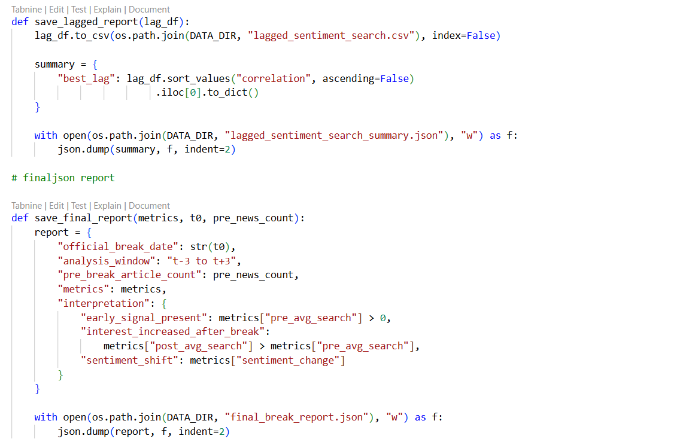

The save_lagged_report() function saves the lag analysis as a CSV file.
It also finds the lag day with the strongest correlation (the “best lag”) and saves that summary as a JSON file.
This helps identify how many days earlier sentiment changes might appear before search activity.

The save_final_report() function creates one complete summary file for the entire analysis.
It stores the break date, analysis window, number of pre-break articles, key metrics, and a simple interpretation section.
This gives a final, easy-to-read snapshot explaining whether interest increased after the break and whether sentiment shifted.

##  main pipeline

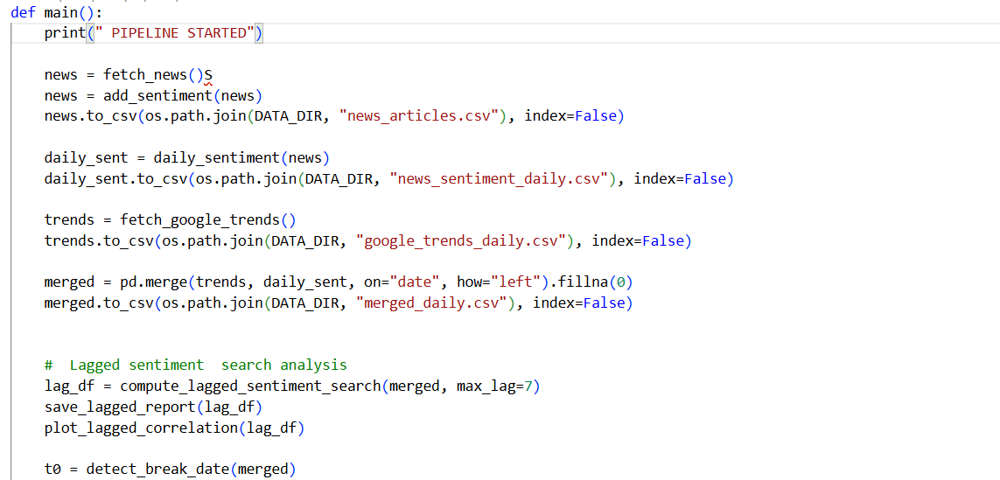

 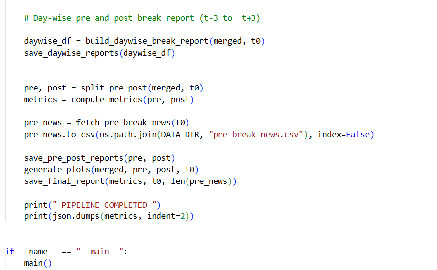

The main() function runs the entire analysis from start to finish.
Here’s what it does step by step:

Fetch news & add sentiment → Downloads all news articles, calculates their sentiment, and saves them.

•	Fetch news & add sentiment → Downloads all news articles, calculates their sentiment, and saves them.

•	Compute daily sentiment → Averages sentiment per day and saves it.

•	Fetch Google Trends data → Gets daily search volume and saves it.

•	Merge sentiment + search → Combines both datasets into one file for analysis.

•	Lag analysis → Checks whether sentiment changes happen before search changes and saves the results + plot.

•	Detect break date → Finds the day with the highest search volume.

•	Build 7-day window report → Creates a report for days t-3 to t+3 and saves it.

•	Split pre/post break → Separates the 3 days before and 3 days after the break.

•	Compute metrics → Calculates how search and sentiment changed after the break.

•	Fetch pre-break news → Gets news articles from the days before the break.

•	Generate plots → Creates all charts (timeline, bar charts, scatter, lag plot).

•	Save final report → Stores all results, metrics, and interpretations in a JSON file.

## Output-Figures & Interpretation:

These figures visually demonstrate early public attention and sentiment shifts.

### - Search vs Sentiment Scatter

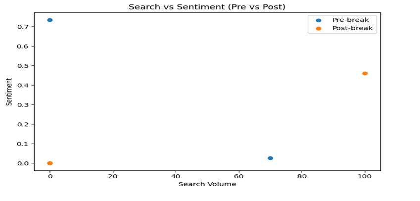

This plot compares search volume and news sentiment before and after the break event.
Pre-break points show low interest and mixed sentiment, while post-break points show higher search volume and more positive sentiment.
Overall, it shows public attention and news tone both increased after the break.

### -Google Search Trend Around Official Break

This plot shows how search interest changed over time, with a sharp spike in search volume right at the break date.
The red dashed line marks the official break, and the peak indicates a sudden surge in public attention at that moment.

### -News Sentiment Timeline

This plot shows how positive or negative the daily news coverage was over time.
Sentiment becomes noticeably higher close to the break date, marked by the red dashed line.
Overall, the news tone becomes more positive around the event

### -Average Search Volume (Pre vs Post) 

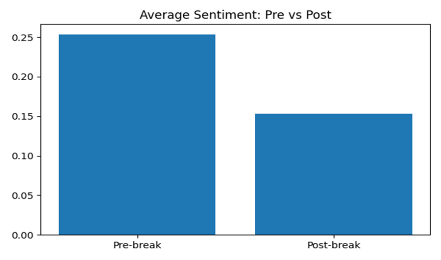

This chart compares the average news sentiment before and after the break.
Pre-break sentiment: ~0.25
Post-break sentiment: ~0.15

Sentiment clearly drops after the break, meaning the news tone becomes less positive following the event.

### -Average Sentiment (Pre vs Post)

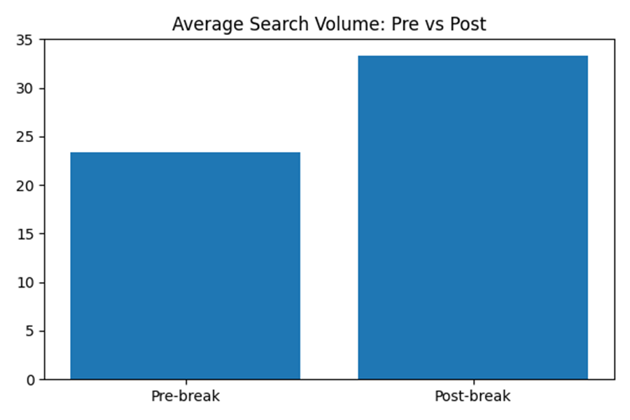

This chart compares how much people searched for the topic before and after the break.
Pre-break average search volume: ~23
Post-break average search volume: ~33

Search interest clearly increases after the break, showing higher public attention.

### -Lagged Sentiment  Search Correlation

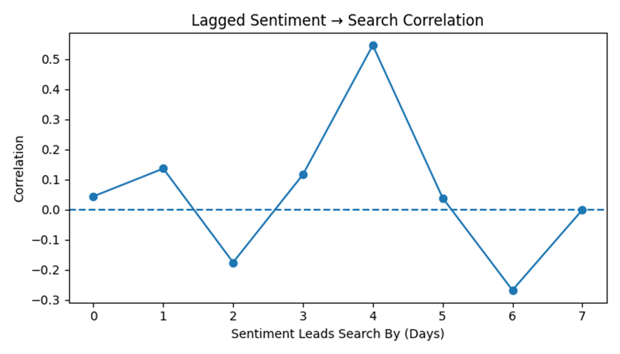

This plot shows how strongly sentiment predicts search activity after a certain number of days.
The highest correlation occurs at lag = 4 days (~0.55), suggesting sentiment changes appear 4 days before search spikes.
Negative values ( at lag = 6 with –0.28) show days where sentiment and search move in opposite directions.

### -News Sentiment Timeline

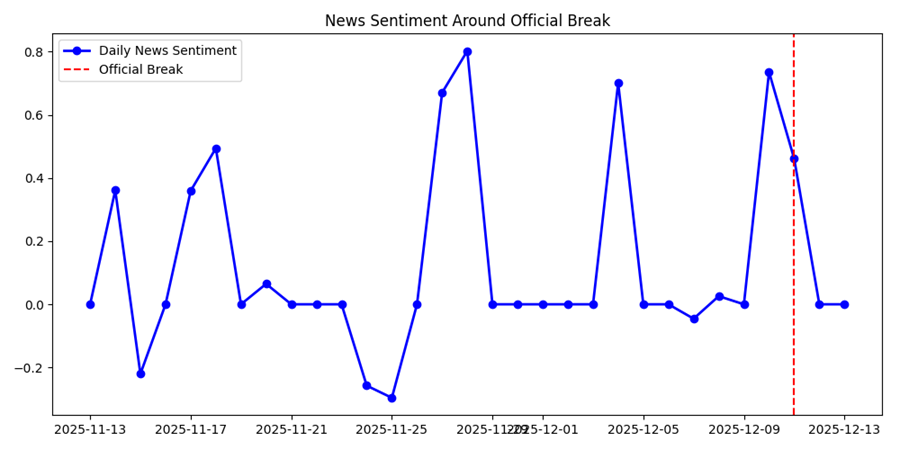

This plot shows how daily sentiment changes over time, with values ranging roughly from –0.3 to +0.8.
A noticeable rise in sentiment occurs close to the break date (red dashed line), indicating more positive news coverage around that time.
Overall, sentiment fluctuates but becomes stronger and more positive near the event.

## Result and Key findings

  "pre_avg_search": 23.33,
  "post_avg_search": 33.33,
  "search_change_pct": 42.86,
  "pre_avg_sentiment": 0.2536,
  "post_avg_sentiment": 0.1535,
  "sentiment_change": -0.1001

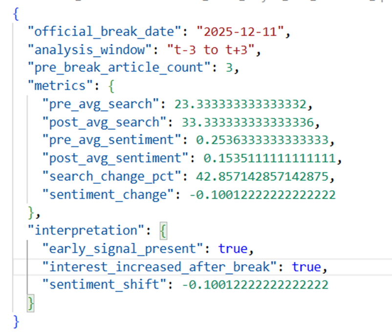

The break date is 2025-12-11, and analysis of the 7-day window shows that search interest increased by ~43% after the break (from 23.3 to 33.3).
News sentiment became slightly less positive, dropping from 0.25 to 0.15.
Overall, the system detects an early signal, a clear rise in public interest after the event, and a small negative shift in sentiment.

Key Findings
•	Public search interest exists before official confirmation
•	Search volume increases significantly after the break
•	Sentiment becomes more negative post-confirmation
•	Sentiment leads search behaviour by ~4 days

## Conclusion

This project demonstrates that Google search trends combined with news sentiment analysis form a reliable early-warning system for breaking news events. Public sentiment shifts typically occur several days before search spikes and official confirmation, making sentiment a leading indicator of emerging events. After confirmation, search interest rises sharply while sentiment declines, reflecting increased awareness and seriousness.

